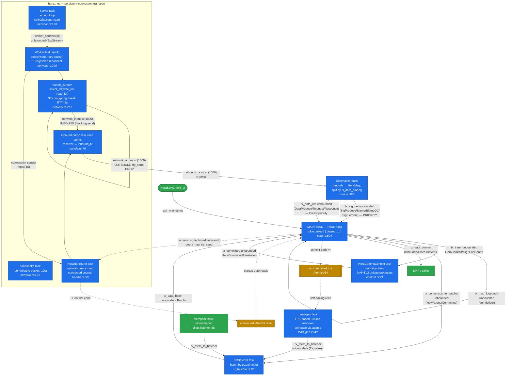
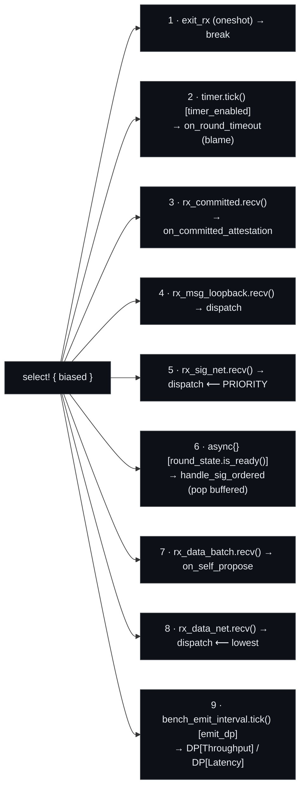

# Hera server architecture

Every box below is a `tokio::spawn` task; every edge is a channel (or shared
atomic, dashed). Source references are `file:line` in `consensus/src/server/hera/`.

## Actors & channels

## Main select loop (biased — top wins)

## Key design points

- **Priority-class split (core.rs:43):** the deserializer fans one inbound
  stream into two channels by `is_data_plane()`. The `biased` select drains
  control + sig-plane (branches 1–6) before the all-to-all data flood
  (7–8), so the leader's `SigPropose`/`Blame`/`BlameQC` never sit behind it.
  This is the large-`n` sig-chain wedge fix.
- **Shedding transport (handle.rs:93):** outbound is `try_send` on bounded(1000)
  per-peer channels, dropping on full. One persistent connection per peer pair
  + jittered reconnect kills the libnet reconnect storm. Asymmetric: the inbound
  read path (network.rs:373) does a *blocking* send — backpressure, not drop.
- **`round_state` (branch 6) is not a channel:** it's an in-memory `VecDeque` +
  `future_msgs` map that `dispatch` writes; branch 6 is a zero-cost `async {}`
  guard popping one buffered sig message per iteration when `is_ready()`.
